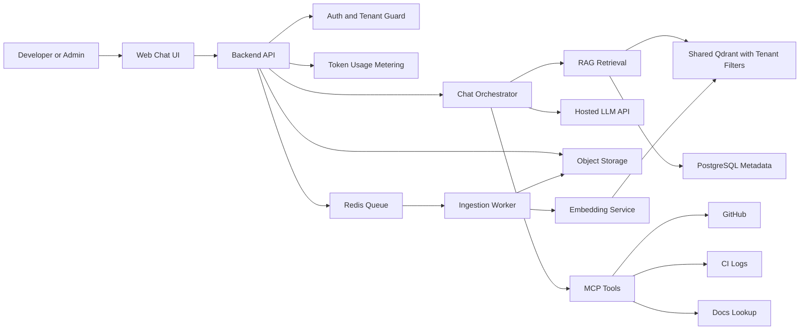
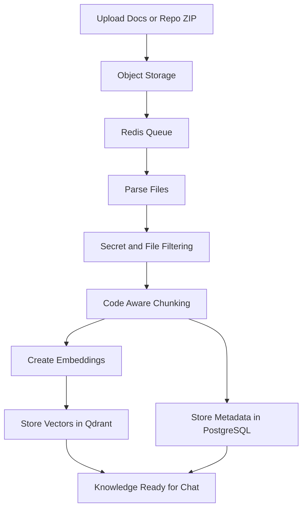
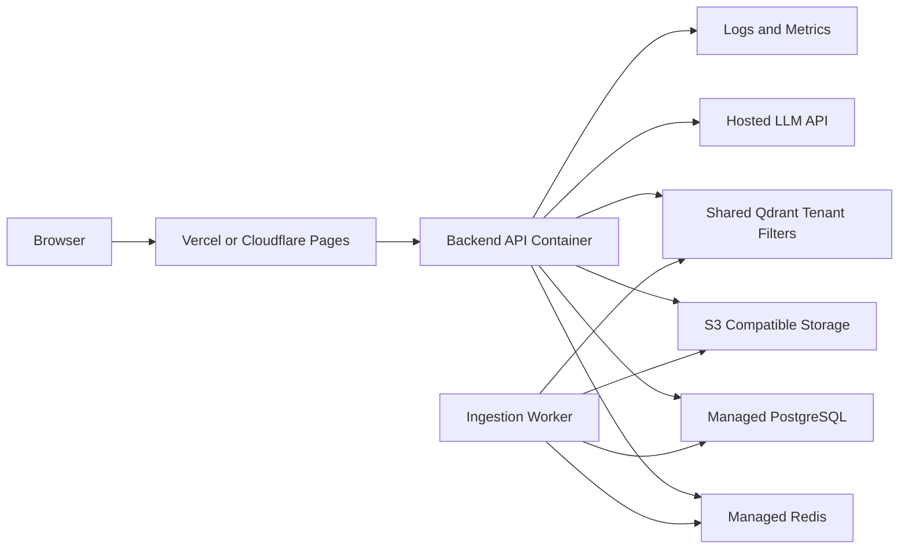
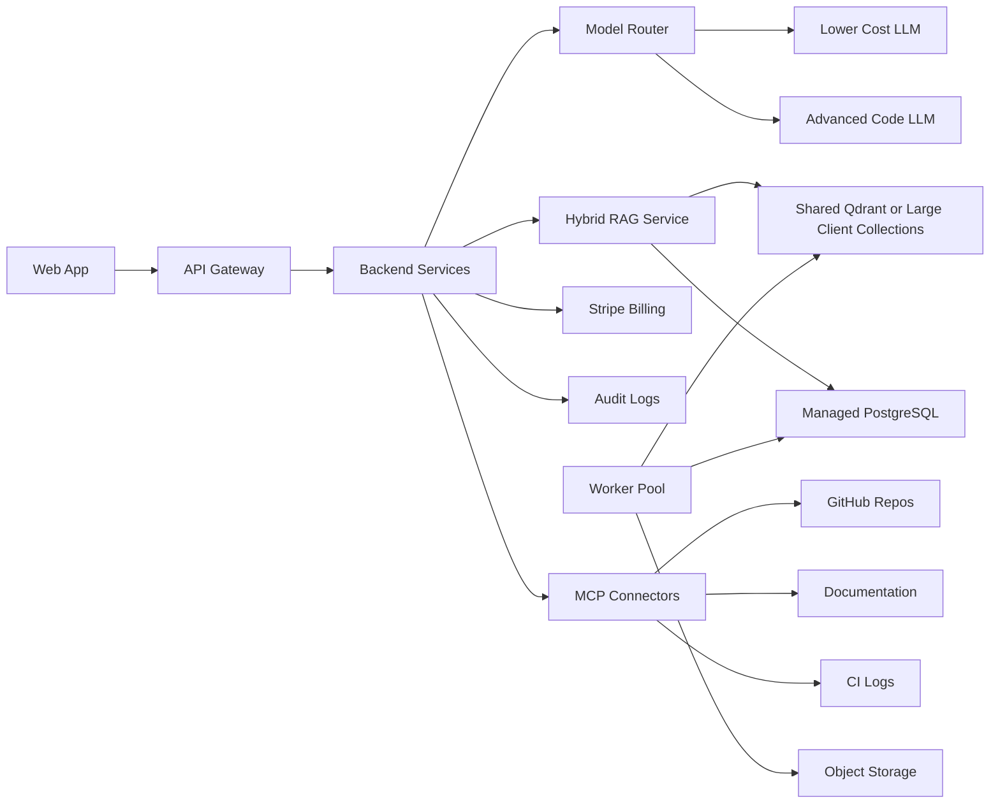
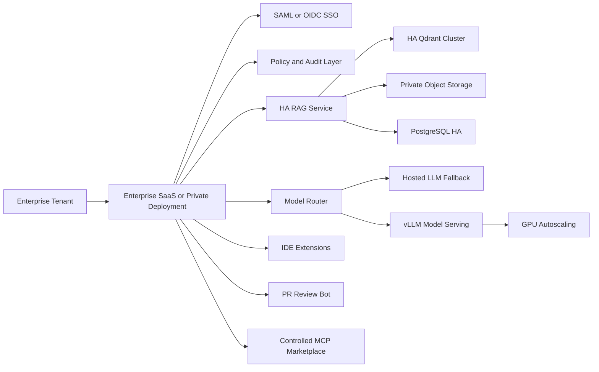
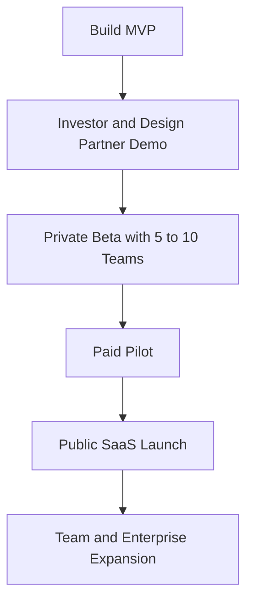
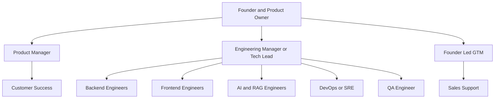

# Custom Knowledge-Based Code Helper: Business and Technical Plan

## Table of Contents

- [1. Executive Summary](#1-executive-summary)
- [2. Business Case and Feasibility](#2-business-case-and-feasibility)
- [3. Product Footprint](#3-product-footprint)
- [4. Technical Architecture](#4-technical-architecture)
- [5. Architecture Diagram](#5-architecture-diagram)
- [6. CPU, GPU, and RAG Database Logic](#6-cpu-gpu-and-rag-database-logic)
- [7. Hardware Resource Plan](#7-hardware-resource-plan)
- [8. Model Strategy](#8-model-strategy)
- [9. CapEx and OpEx](#9-capex-and-opex)
- [10. MVP Budget Estimate](#10-mvp-budget-estimate)
- [11. Phase 1 Budget Estimate](#11-phase-1-budget-estimate)
- [12. Phase 2 Budget Estimate](#12-phase-2-budget-estimate)
- [13. Revenue Model](#13-revenue-model)
- [14. MVP Feature Scope](#14-mvp-feature-scope)
- [15. MVP Deployment Plan](#15-mvp-deployment-plan)
- [16. MVP Timeline](#16-mvp-timeline)
- [17. MVP User Stories](#17-mvp-user-stories)
- [18. Phase 1 Plan](#18-phase-1-plan)
- [19. Phase 2 Plan](#19-phase-2-plan)
- [20. Go-To-Market Plan](#20-go-to-market-plan)
- [21. Team Structure](#21-team-structure)
- [22. Organization Chart for Phase 1](#22-organization-chart-for-phase-1)
- [23. Detailed Work Plan](#23-detailed-work-plan)
- [24. Investor-Focused Milestones](#24-investor-focused-milestones)
- [25. Key Risks and Mitigation](#25-key-risks-and-mitigation)
- [26. Recommended MVP Tech Stack](#26-recommended-mvp-tech-stack)
- [27. MVP Feature Backlog](#27-mvp-feature-backlog)
- [28. Suggested Investor Ask](#28-suggested-investor-ask)
- [29. Final Investor Narrative](#29-final-investor-narrative)
- [30. Final Recommendation](#30-final-recommendation)

## 1. Executive Summary

### Product Name Options

- **CodeMind SaaS**
- **DevAssist AI**

### One-Line Pitch

A secure AI coding assistant for engineering teams that understands their private codebase, organization-specific documentation, shared coding knowledge, internal standards, and DevOps workflows, then provides accurate code help through chat.

### Investor Pitch

Modern engineering teams waste significant time searching documentation, debugging code, onboarding developers, reviewing pull requests, and understanding legacy systems. General AI chatbots are useful, but they do not deeply understand a company's private repositories, internal standards, framework versions, or operational context.

This product solves that gap by offering a custom knowledge-based code helper where each client receives a tenant-isolated SaaS workspace and can connect their own code repositories, documentation, runbooks, tickets, and engineering standards. The AI assistant answers by combining a shared universal coding knowledge base with the client's private organization knowledge using retrieval augmented generation (RAG), with optional Model Context Protocol (MCP) and tool integrations for GitHub, CI logs, documentation lookup, and controlled external access.

### Core Product Objective

The company will sell a client-wise SaaS coding assistant to software firms. Each client gets its own workspace, admin users, developer users, private knowledge base, usage tracking, and billing package. Developers use a chat window for coding, debugging, architecture, documentation, and DevOps questions. Admins manage sources and users, see user-wise usage, and control package limits. Individual users can see only their own personal usage.

The MVP should be positioned as an LLM plus RAG product, not as a separate custom-trained model for every client. The product can later support self-hosted models, fine-tuning, or dedicated infrastructure for enterprise customers, but the scalable starting point is:

- One strong code-capable LLM or model router
- One centrally maintained universal coding knowledge base
- One private tenant-isolated knowledge base per client
- Usage tracking by tenant and by individual user
- Package-based SaaS billing with token limits and overage options

## 2. Business Case and Feasibility

### Problem

Engineering teams face recurring productivity and quality challenges:

| Pain Point | Business Impact |
| --- | --- |
| Developers spend time searching documentation | Productivity loss |
| New team members struggle with codebase onboarding | Longer ramp-up time |
| Senior engineers answer repeated questions | High-value engineering time wasted |
| Debugging repeated errors is slow | Delayed delivery |
| Internal code standards are not always followed | Quality and security risk |
| Generic AI chatbots do not know private repositories | Limited usefulness |
| Ungoverned AI tools may leak code or sensitive context | Security concern |

### Solution

The product is a private SaaS code assistant that can answer questions across Python, PHP, .NET, backend services, and DevOps workflows, such as:

- How does this service work?
- Why is this Python error happening?
- Why is this PHP/Laravel error happening?
- Explain this C#/.NET service class.
- Where is authentication handled in this repository?
- Generate a `pytest` test for this function.
- Review this FastAPI endpoint.
- Explain this Kubernetes deployment file.
- What changed in this pull request?
- How do we follow our internal coding standard here?

### Target Customers

| Segment | Need |
| --- | --- |
| Small software companies | Affordable AI code helper |
| DevOps and MLOps teams | Infrastructure, Python, PHP, .NET, and automation support |
| SaaS product teams | Private repository Q&A |
| Training companies | Student coding assistant |
| Enterprise engineering teams | Secure internal knowledge assistant |
| Government and private-sector organizations | Air-gapped or private deployment in later phases |

### Why It Is Feasible

The product does not need to start by training a 70B or 79B parameter model from scratch. The MVP can be built with:

- Existing hosted LLM APIs or hosted code models
- RAG using Qdrant
- Private repository and document ingestion
- Shared universal coding knowledge plus client-specific private knowledge
- Token metering
- SaaS dashboard and admin workflows

Usage-based billing is a common SaaS pricing pattern where customers are charged according to actual consumption. Stripe supports usage-based billing, which makes token-based SaaS packaging practical.

## 3. Product Footprint

### Core Product

**Custom Knowledge-Based Code Helper**

### Main Capabilities

| Area | Feature |
| --- | --- |
| Chat | Developers ask coding questions in a conversational interface |
| RAG | Answers are grounded in private repositories and documents |
| Code understanding | Explains files, functions, services, errors, and architecture |
| Debugging | Suggests fixes for tracebacks, logs, and failing workflows |
| Test generation | Generates `pytest` and unit test examples |
| Code review | Reviews snippets or pull request changes |
| Docs Q&A | Answers from official and client-specific documentation |
| Universal coding knowledge | Uses a centrally maintained coding manual and public best-practice knowledge base |
| Tenant isolation | Keeps each client knowledge base separate |
| Billing | Tracks token usage for SaaS billing |
| Admin portal | Manages users, repositories, sources, package limits, and user-wise usage |
| User portal | Lets individual users view only their own usage and conversation history |
| Central SaaS admin | Monitors client workspaces separately for support, usage control, and billing operations |
| MCP/tools | Provides controlled GitHub, documentation, and CI access |

## 4. Technical Architecture

### Important Design Principle

The LLM should not be treated as the only knowledge source. The LLM is the reasoning and answer generation engine, while the customer's knowledge base is retrieved from dedicated storage and search systems.

### Correct System Structure

| Component | Purpose |
| --- | --- |
| LLM | Reasoning and answer generation engine |
| Qdrant/vector DB | Shared RAG retrieval layer with tenant-aware isolation |
| PostgreSQL | Users, tenants, billing, metadata, and conversations |
| Object storage | Uploaded documents, repository snapshots, and source files |
| Redis/queue | Async ingestion and background jobs |
| MCP/tools | Controlled external integrations |
| Billing engine | Token usage, plan limits, and invoices |

Qdrant is suitable for vector similarity search and semantic retrieval. Qdrant Cloud can support early experimentation with a free tier before scaling to paid clusters. Actual production cost should be verified against the selected region, usage pattern, and service plan before investor submission.

### RAG Database and Tenant Isolation Strategy

The recommended design is a shared Qdrant cluster with strong tenant isolation, rather than a separate database for every client during the MVP. This keeps infrastructure cost low while still supporting client-wise SaaS packaging.

Recommended structure:

- A shared universal coding knowledge collection for common coding manuals, public best practices, framework guidance, and general engineering knowledge.
- Tenant-isolated client knowledge stored with strict `tenant_id`, `workspace_id`, `source_id`, language, repository, and access metadata.
- Retrieval filters enforced by the backend so a user can retrieve only universal knowledge plus private knowledge belonging to that user's own tenant.
- Per-user and per-tenant usage records stored in PostgreSQL for admin reporting, user self-service usage views, package limits, and billing.
- Larger clients can move to a dedicated collection, dedicated Qdrant cluster, or private deployment in Phase 1 or Phase 2 when compliance, scale, or contract value justifies it.

This gives the product a practical upgrade path:

| Stage | RAG DB Design |
| --- | --- |
| MVP | Shared Qdrant cluster with strict tenant filters and a shared universal coding knowledge collection |
| Phase 1 | Shared production cluster with stronger tenant controls; optionally one collection for larger clients |
| Phase 2 | Dedicated Qdrant cluster, VPC, or private deployment for enterprise and regulated clients |

## 5. Architecture Diagram

Diagram source file: `../diagrams/01-product-architecture.mmd`

### Ingestion Pipeline

Diagram source file: `../diagrams/02-ingestion-pipeline.mmd`

## 6. CPU, GPU, and RAG Database Logic

### What Runs on CPU?

CPU resources are enough for:

- Frontend hosting
- Backend API
- Authentication
- Billing
- PostgreSQL
- Redis
- Qdrant small and medium workloads
- Document ingestion
- Chunking
- Metadata processing
- Admin dashboard

### What Needs GPU?

GPU is mainly needed if the company self-hosts the LLM or runs large-scale embedding workloads.

GPU is useful for:

- LLM inference
- Embedding generation at scale
- Batch processing large ingestion jobs
- Optional fine-tuning in later phases

For the MVP, GPU can be avoided by using a hosted LLM API. This keeps CapEx low and reduces infrastructure complexity.

### Best MVP Approach

For MVP:

- Use an API-based LLM
- Use Qdrant Cloud or a small self-hosted Qdrant deployment as a shared cluster with strict tenant filters
- Use CPU servers for backend services
- Use managed PostgreSQL

This approach is cheaper, faster, and investor-friendly.

### Best Phase 1 Approach

For Phase 1, use a hybrid model:

- API LLM for best answer quality
- Optional self-hosted open-source code model for cost control
- Shared Qdrant production cluster with stronger tenant controls and optional dedicated collections for larger clients
- Separate ingestion workers

### Best Phase 2 Approach

For Phase 2:

- Self-host model serving using vLLM
- Add GPU autoscaling
- Support dedicated tenant collections, clusters, or private RAG infrastructure
- Offer enterprise or private deployment
- Consider optional fine-tuned models

vLLM is a strong option for self-hosted LLM serving because it supports OpenAI-compatible serving, automatic prefix caching, LoRA support, and online serving features. Its project documentation highlights PagedAttention and continuous batching for improved throughput and GPU utilization.

## 7. Hardware Resource Plan

### MVP Hardware

Recommended MVP architecture:

- Frontend: Vercel or Cloudflare Pages
- Backend: 1-2 CPU VMs or container service
- Database: Managed PostgreSQL
- Vector DB: Shared Qdrant Cloud free or small paid tier with tenant filters
- LLM: Hosted API
- Object storage: S3-compatible bucket
- Queue: Redis or managed queue

### MVP Compute Requirement

| Component | Estimated Resource |
| --- | --- |
| Backend API | 2-4 vCPU, 8-16 GB RAM |
| Worker | 2-4 vCPU, 8-16 GB RAM |
| PostgreSQL | 2 vCPU, 4-8 GB RAM |
| Qdrant | Free or small managed shared cluster with tenant filtering |
| Redis | 1-2 GB RAM |
| GPU | Not required |

### MVP Hardware Cost Estimate

These are approximate monthly cloud resource costs for early MVP operation. They exclude human cost and separate LLM token usage, which is covered in the MVP monthly OpEx section.

| Resource | Estimated Monthly Cost | Notes |
| --- | ---: | --- |
| Frontend hosting | $0-$25 | Vercel, Cloudflare Pages, or similar starter tier |
| Backend API compute | $100-$250 | Small VM, container service, or app platform |
| Ingestion worker compute | $50-$200 | Can run as a small worker or scheduled job initially |
| Managed PostgreSQL | $50-$200 | Small managed database instance |
| Qdrant vector database | $0-$150 | Free or small managed shared cluster for early usage |
| Redis/queue | $20-$100 | Managed Redis or lightweight queue service |
| Object storage | $10-$100 | S3-compatible storage for uploads and repo snapshots |
| Logging and basic monitoring | $50-$200 | Cloud-native logs or lightweight Grafana/Prometheus setup |

**Estimated MVP hardware/resource cost:** $280-$1,225/month before LLM token usage.

### Phase 1 Hardware

| Component | Estimated Resource |
| --- | --- |
| Backend | 2-3 replicas, 4 vCPU and 16 GB RAM each |
| Workers | 2-4 workers, 4-8 vCPU each |
| PostgreSQL | Managed medium instance |
| Qdrant | Shared production cluster; optional dedicated collection for larger clients |
| Redis | Managed Redis |
| LLM | API plus optional small self-hosted model |
| GPU | Optional NVIDIA L4 class |

AWS G6 instances use NVIDIA L4 GPUs. AWS states G6 can scale up to 8 NVIDIA L4 Tensor Core GPUs with 24 GB memory per GPU and are designed for machine learning and graphics workloads. NVIDIA lists the L4 GPU with 24 GB GPU memory and 300 GB/s memory bandwidth. These specifications should be verified before final infrastructure purchase.

### Phase 1 Hardware Cost Estimate

Phase 1 costs increase because the platform needs stronger production isolation, staging environments, more ingestion capacity, and higher retrieval throughput.

| Resource | Estimated Monthly Cost | Notes |
| --- | ---: | --- |
| Backend service replicas | $500-$1,500 | Multiple replicas for production reliability |
| Ingestion worker pool | $400-$1,600 | More parallel indexing and embedding jobs |
| Managed PostgreSQL | $500-$2,000 | Medium production database with backups |
| Qdrant production cluster | $200-$1,000+ | Shared production cluster, with optional dedicated collections for larger clients |
| Managed Redis/queue | $100-$500 | Production queue and cache |
| Object storage and transfer | $100-$500 | Repository snapshots, documents, and exports |
| Dev/staging/prod environments | $500-$2,000 | Separate environments for release safety |
| Monitoring, logs, and alerts | $300-$1,000 | Operational visibility and incident response |
| Optional L4 GPU node | $600-$1,500+ | Only needed for limited self-hosted inference or experiments |

**Estimated Phase 1 hardware/resource cost:** $2,600-$11,600/month, including optional GPU capacity and excluding LLM API usage.

### Phase 2 Hardware

| Component | Estimated Resource |
| --- | --- |
| LLM serving | GPU nodes with L4, A10, or H100 depending on model and workload |
| RAG DB | Highly available Qdrant cluster, with dedicated enterprise options |
| Backend | Kubernetes autoscaling |
| Ingestion | Separate worker pool |
| Fine-tuning | Dedicated GPU jobs |
| Enterprise | Single-tenant deployment option |

### Phase 2 Hardware Cost Estimate

Phase 2 hardware cost depends heavily on enterprise isolation, self-hosted model serving, GPU class, customer data volume, and availability requirements.

| Resource | Estimated Monthly Cost | Notes |
| --- | ---: | --- |
| Kubernetes production infrastructure | $3,000-$15,000 | Autoscaling application and platform workloads |
| GPU serving cluster | $5,000-$50,000+ | L4, A10, or H100 class depending on model size and traffic |
| HA Qdrant cluster | $1,000-$5,000 | Higher availability vector retrieval layer |
| HA PostgreSQL | $1,000-$5,000 | Production metadata, billing, and conversation database |
| Redis/queue cluster | $500-$3,000 | Higher throughput ingestion and async jobs |
| Object storage, backups, and transfer | $1,000-$5,000 | Larger private repositories, documents, and retention |
| Dedicated ingestion workers | $1,000-$5,000 | Batch ingestion and embedding workloads |
| Observability and security tooling | $2,000-$10,000 | Logs, metrics, tracing, SIEM, audit, and compliance support |
| Enterprise single-tenant environments | $3,000-$20,000+ | Per-customer private deployment or VPC option |

**Estimated Phase 2 hardware/resource cost:** $17,500-$118,000+/month before LLM API fallback, support tooling, and customer success cost.

## 8. Model Strategy

### MVP Model Strategy

Use a hosted model first.

Reasons:

- No GPU management
- Lower engineering complexity
- Faster MVP launch
- Better quality from day one
- Easier token metering

The MVP should support Python first, then add PHP and .NET as additional supported languages through parsing, chunking, prompts, and curated universal knowledge. This does not require separate model training for each language. It mainly adds ingestion test cases, language-aware chunking rules, framework examples, and evaluation questions for Python, PHP/Laravel, and C#/.NET.

Example cost logic: public pricing for major LLM providers changes frequently and should be verified immediately before investor submission. For cost-sensitive workloads, model routing is important: simple questions can go to a cheaper model, while complex code debugging or architecture tasks can go to a stronger model.

### Hosted LLM API Feasibility for MVP

For the MVP, the recommended single hosted LLM is **GPT-5.4 mini** or an equivalent cost-efficient coding-capable hosted model. This keeps the product simple: one hosted LLM generates chat answers, while Qdrant retrieves universal coding knowledge and tenant-specific private context.

Indicative public pricing should be verified before investor submission. As of the latest planning assumption, OpenAI lists GPT-5.4 mini at approximately:

| Model | Input Cost | Output Cost | Positioning |
| --- | ---: | ---: | --- |
| GPT-5.4 mini | $0.75 / 1M tokens | $4.50 / 1M tokens | Recommended MVP primary model for coding quality and cost balance |
| GPT-5 mini | $0.25 / 1M tokens | $2.00 / 1M tokens | Lower-cost fallback candidate for simpler requests |
| Gemini 2.5 Flash | $0.30 / 1M tokens | $2.50 / 1M tokens | Alternative provider candidate for cost comparison |
| Gemini 2.5 Flash-Lite | $0.10 / 1M tokens | $0.40 / 1M tokens | Very low-cost option for simple classification, summarization, or fallback tasks |

Sources to verify before formal investor use:

- OpenAI API pricing: <https://openai.com/api/pricing/>
- OpenAI GPT-5.4 mini model page: <https://developers.openai.com/api/docs/models/gpt-5.4-mini>
- OpenAI GPT-5 mini model page: <https://developers.openai.com/api/docs/models/gpt-5-mini>
- Google Gemini API pricing: <https://ai.google.dev/pricing>

Example monthly LLM cost estimate for one active business client:

| Monthly Usage Assumption | Cost Calculation | Estimated LLM Cost |
| --- | --- | ---: |
| 20M input tokens | 20 x $0.75 | $15.00 |
| 5M output tokens | 5 x $4.50 | $22.50 |
| Total | GPT-5.4 mini usage estimate | **$37.50/month** |

This supports a feasible SaaS business case if the product includes package limits, token metering, caching, source filtering, and overage billing. A $499/month business plan can absorb estimated LLM usage, Qdrant, PostgreSQL, hosting, storage, monitoring, and support when usage caps are enforced. The company should not offer unlimited usage in early packages.

### Phase 1 Model Strategy

Use a model router:

| Task Type | Model Strategy |
| --- | --- |
| Simple Q&A | Lower-cost model |
| Code explanation | Mid-tier model |
| Complex debugging | Advanced model |
| Enterprise private tenant | Optional self-hosted model |

### Phase 2 Model Strategy

Self-host selected open-source code models using:

- vLLM
- Kubernetes
- GPU autoscaling
- Quantization
- Prompt caching
- Batching

## 9. CapEx and OpEx

### Key Definitions

| Term | Meaning |
| --- | --- |
| CapEx | One-time setup or build investment |
| OpEx | Monthly running cost |

For a SaaS MVP, most costs are OpEx, not traditional CapEx, because the product uses cloud infrastructure and API-based services.

## 10. MVP Budget Estimate

### MVP Duration

**Estimated duration:** 10-12 weeks

### MVP Team Size

**Estimated team size:** 4-6 people

### MVP Build Cost Estimate

| Role | Count | Duration | Approximate Cost |
| --- | ---: | --- | ---: |
| Tech Lead/Architect | 1 | 3 months | $6k-$15k |
| Backend Engineer | 1 | 3 months | $4k-$12k |
| Frontend Engineer | 1 | 2-3 months | $3k-$9k |
| AI/RAG Engineer | 1 | 3 months | $5k-$15k |
| DevOps Engineer | 0.5-1 | 2 months | $3k-$8k |
| QA/Product Support | 0.5 | 1-2 months | $1k-$4k |

### MVP Human Cost Range

| Scenario | Estimated Cost |
| --- | ---: |
| Low-cost lean team | $20k-$35k |
| Stronger professional team | $40k-$70k |

### MVP Monthly OpEx

| Item | Monthly Cost Estimate |
| --- | ---: |
| Hosting backend/API | $100-$300 |
| PostgreSQL | $50-$200 |
| Qdrant | $0-$150 |
| Redis/queue | $20-$100 |
| Object storage | $10-$100 |
| LLM API usage | $200-$2,000 initially |
| Monitoring/logging | $50-$200 |
| Email/auth/miscellaneous | $30-$100 |
| Domain/security/tools | $20-$100 |

**Estimated MVP monthly OpEx range:** $500-$3,000/month

The MVP hardware/resource estimate in Section 7 is approximately $280-$1,225/month before LLM token usage. The full OpEx range is higher because it also includes LLM usage, email/auth services, security tooling, and miscellaneous SaaS operating costs.

Qdrant Cloud's free tier can support early experiments, and paid usage scales based on cluster resources. Pricing should be verified before final budgeting.

## 11. Phase 1 Budget Estimate

### Phase 1 Duration

**Estimated duration:** 4-6 months after MVP

### Phase 1 Goal

Move from MVP to paid pilot customers.

### Phase 1 Team Size

**Estimated team size:** 8-12 people

### Phase 1 Monthly OpEx

| Item | Monthly Cost Estimate |
| --- | ---: |
| Production cloud infrastructure | $1k-$3k |
| LLM API usage | $2k-$10k |
| Qdrant production cluster | $200-$1k+ |
| Database/Redis/storage | $500-$2k |
| Monitoring/security | $300-$1k |
| Dev/staging/prod environments | $500-$2k |
| Support and customer success tools | $200-$1k |

**Estimated Phase 1 monthly OpEx range:** $5k-$20k/month

The Phase 1 hardware/resource estimate in Section 7 is approximately $2.6k-$11.6k/month, including optional GPU capacity and excluding LLM API usage. The full OpEx range includes model usage, support tools, security operations, and staging/production overhead.

**Estimated Phase 1 build and operational investment:** $150k-$300k

## 12. Phase 2 Budget Estimate

### Phase 2 Duration

**Estimated duration:** 6-12 months after Phase 1

### Phase 2 Goal

Scale to enterprise customers, larger teams, private deployment, and optional self-hosted model serving.

### Phase 2 Team Size

**Estimated team size:** 15-25 people

### Phase 2 Monthly OpEx

| Item | Monthly Cost Estimate |
| --- | ---: |
| GPU serving | $5k-$50k+ |
| Kubernetes production infrastructure | $3k-$15k |
| LLM API fallback | $5k-$30k |
| Vector DB HA cluster | $1k-$5k |
| Observability/security/compliance | $2k-$10k |
| Support/customer success | $5k-$20k |
| Data ingestion jobs | $1k-$5k |

**Estimated Phase 2 monthly OpEx range:** $25k-$150k/month

The Phase 2 hardware/resource estimate in Section 7 is approximately $17.5k-$118k+/month before LLM API fallback and support costs. GPU serving and single-tenant enterprise deployments are the largest potential cost drivers.

GPU cost can become the biggest cost driver. Third-party cloud pricing trackers may show G6 instances near the low single-digit dollar-per-hour range and H100-class instances at much higher rates. These numbers should be verified in the target AWS region before final investor submission.

## 13. Revenue Model

### Suggested Pricing

| Plan | Monthly Price | Included Usage |
| --- | ---: | --- |
| Free/Trial | $0 | Limited tokens, public docs only |
| Developer Pro | $19-$49/user | Personal usage, small repository |
| Team | $99-$299/team | Shared workspace, repository ingestion |
| Business | $499-$1,999/month | More tokens, private knowledge base, admin usage reporting |
| Enterprise | Custom | SSO, audit logs, private deployment |

### Usage-Based Add-Ons

- Extra input and output tokens
- Extra repository storage
- Extra ingestion jobs
- Extra MCP tool calls
- Extra private workspaces

Stripe supports usage-based billing models where customers are charged based on actual product usage.

### Example Unit Economics

Assumptions:

- Average paying team: $499/month
- LLM and infrastructure cost per team: $100-$180/month
- Estimated gross margin: 60%-80%
- Hosted LLM usage is controlled through included token limits, caching, retrieval limits, and overage billing.

| Customers | Estimated Monthly Revenue |
| ---: | ---: |
| 10 teams | ~$5k MRR |
| 50 teams | ~$25k MRR |
| 100 teams | ~$50k MRR |
| 500 teams | ~$250k MRR |

The hosted LLM API is economically feasible because the product is not reselling raw model access. The customer pays for a client-wise coding knowledge SaaS layer: private repository Q&A, universal coding knowledge, tenant isolation, admin/user usage reporting, source citations, and billing controls.

## 14. MVP Feature Scope

### MVP Must-Have Features

| Feature | Description |
| --- | --- |
| User signup/login | Email/password or OAuth |
| Workspace/tenant | Each client has its own workspace |
| Chat interface | Streaming AI answers |
| Code-aware Markdown | Syntax-highlighted code blocks |
| MVP language coverage | Python, PHP, and .NET code assistance through prompts, parsing, and RAG evaluation |
| RAG ingestion | Upload documents and repository files |
| Qdrant search | Retrieve universal coding knowledge plus tenant-specific private chunks |
| Source citation | Show where answer came from |
| Token tracking | Track input and output tokens |
| Admin panel | View sources, package limits, tenant usage, and individual user-wise usage |
| User usage view | Each user can view only their own token and conversation usage |
| Central SaaS admin console | Monitor client workspaces separately, review package usage, and support billing operations |
| Basic billing-ready data | Store usage for future billing |
| Guardrails | Prevent cross-tenant leakage |
| Logs/monitoring | Basic observability |

### MVP User Journeys

Detailed journey artifact: `docs/mvp-user-journeys.md`

| User Type | Primary Goal | MVP Features Used |
| --- | --- | --- |
| Client developer user | Ask coding and internal knowledge questions through chat | User signup/login, workspace/tenant, chat interface, code-aware Markdown, MVP language coverage, Qdrant search, source citation, token tracking, user usage view, guardrails |
| Client admin user | Manage the client workspace, uploaded knowledge, users, package limits, and team usage | User signup/login, workspace/tenant, RAG ingestion, admin panel, token tracking, basic billing-ready data, logs/monitoring, guardrails |
| Central SaaS admin | Monitor and support all client workspaces separately without cross-tenant data leakage | Central SaaS admin console, workspace/tenant, token tracking, basic billing-ready data, logs/monitoring, guardrails |
| Founder/product operator | Run demos, inspect adoption, and validate which teams receive value | Chat interface, source citation, token tracking, central SaaS admin console, logs/monitoring, basic billing-ready data |
| Support/customer success user | Help client admins troubleshoot onboarding, uploads, and usage questions | Central SaaS admin console, logs/monitoring, workspace/tenant, admin panel, source management metadata |
| Finance/billing operator | Prepare package usage reports and billing reconciliation | Token tracking, basic billing-ready data, central SaaS admin console, admin panel |

For the MVP, the developer journey proves source-backed chat value; the client admin journey proves workspace and knowledge-base control; the central SaaS admin journey proves provider-side operations, usage monitoring, and tenant separation. Support, billing, founder/product, and investor reviewer journeys are secondary but important because they connect the product workflow to onboarding, revenue operations, demos, and investor validation.

### MVP Should Not Include

- Training a 70B or 79B model
- Complex fine-tuning
- Enterprise SSO
- Air-gapped deployment
- Full IDE extension
- Full pull request automation
- Unlimited external MCP tools

## 15. MVP Deployment Plan

### MVP Deployment Target

- Cloud-based SaaS
- Single region
- Multi-tenant but logically isolated
- Shared Qdrant cluster with tenant filters for MVP
- API LLM-based
- Managed vector database and database where possible

### Recommended MVP Deployment

Diagram source file: `../diagrams/03-mvp-deployment-architecture.mmd`

### MVP Environments

- Development
- Staging
- Production

### MVP Deployment Tools

| Area | Tool |
| --- | --- |
| Frontend | Vercel or Cloudflare Pages |
| Backend | Docker with ECS/Fargate, Render, Railway, or Kubernetes later |
| Database | Managed PostgreSQL |
| Vector DB | Shared Qdrant Cloud with tenant filters |
| Object storage | S3-compatible storage |
| CI/CD | GitHub Actions |
| Monitoring | Grafana/Prometheus or cloud monitoring |
| Billing later | Stripe |

## 16. MVP Timeline

### Total MVP Time

**Estimated duration:** 10-12 weeks

### Sprint Plan

Assumption: 2-week sprints.

| Sprint | Duration | Goal |
| --- | --- | --- |
| Sprint 0 | 1 week | Product discovery and architecture |
| Sprint 1 | 2 weeks | Auth, tenant, and base chat UI |
| Sprint 2 | 2 weeks | LLM integration, streaming, and initial Python/PHP/.NET prompt support |
| Sprint 3 | 2 weeks | RAG ingestion, shared Qdrant tenant retrieval, and language-aware chunking |
| Sprint 4 | 2 weeks | Admin, per-user usage metering, package limits, and security |
| Sprint 5 | 2 weeks | Pilot readiness, QA, and deployment |
| Buffer | 1 week | Fixes and investor demo polish |

## 17. MVP User Stories

### User Story 1: Developer Chat

As a developer, I want to ask a Python, PHP, or .NET question in chat so that I can get code help quickly.

Acceptance criteria:

- User can submit a question.
- Answer streams in the UI.
- Code blocks are formatted.
- MVP supports Python, PHP, and .NET examples.
- Conversation history is saved.

### User Story 2: Upload Knowledge

As a team admin, I want to upload internal docs or repository files so that the assistant can answer from company knowledge.

Acceptance criteria:

- Admin uploads a file.
- System chunks the file.
- Embeddings are created.
- Chunks are stored in Qdrant.
- Assistant retrieves relevant chunks.

### User Story 3: Private Repository Q&A

As a developer, I want to ask questions about my project codebase so that I can understand internal services faster.

Acceptance criteria:

- Assistant retrieves only tenant-specific code.
- Assistant can also retrieve shared universal coding knowledge.
- Answer cites matching files and chunks.
- No cross-tenant retrieval occurs.

### User Story 4: Token Usage

As a SaaS admin, I want to track token usage by tenant and by individual user so that I can bill customers correctly and show client admins their team usage.

Acceptance criteria:

- Input tokens are stored.
- Output tokens are stored.
- Model name is stored.
- Conversation ID is stored.
- Tenant usage report is available.
- User-wise usage report is available to the client admin.
- Individual users can view only their own personal usage.

### User Story 5: Admin Knowledge Management

As an admin, I want to see uploaded sources so that I can manage the knowledge base.

Acceptance criteria:

- Admin can view sources.
- Admin can delete a source.
- Deleted source is removed from retrieval.

### User Story 6: Central SaaS Admin Monitoring

As a central SaaS admin, I want to monitor client workspaces separately so that I can support customers, control usage risk, and prepare billing data without breaking tenant isolation.

Acceptance criteria:

- Central admin can view tenant list, package status, usage summary, and ingestion status.
- Central admin can inspect logs and operational metadata by tenant.
- Central admin can export or review billing-ready usage records.
- Central admin cannot retrieve another client's private knowledge through normal chat workflows.

## 18. Phase 1 Plan

### Phase 1 Objective

Convert MVP into a paid pilot-ready product.

### Timeline

**Estimated duration:** 4-6 months after MVP

### Features

| Area | Phase 1 Feature |
| --- | --- |
| GitHub integration | Connect repositories and index selected branches |
| Advanced RAG | Hybrid search and metadata filtering |
| Billing | Stripe subscription plus token usage |
| Team management | Invite members and assign roles |
| Security | Audit logs and secret detection |
| Model routing | Lower-cost and stronger model selection |
| Admin analytics | Usage dashboard |
| Tenant scaling | Optional dedicated Qdrant collections for larger clients |
| Feedback loop | Thumbs up/down and answer rating |
| Prompt evaluation | Regression tests for answer quality |
| MCP beta | GitHub, documentation, and CI connector |

### Phase 1 Architecture Upgrade

Diagram source file: `../diagrams/05-phase1-architecture.mmd`

## 19. Phase 2 Plan

### Phase 2 Objective

Build an enterprise-scale product.

### Timeline

**Estimated duration:** 6-12 months after Phase 1

### Features

| Area | Phase 2 Feature |
| --- | --- |
| Enterprise SSO | SAML/OIDC |
| Private deployment | VPC, on-prem, or air-gapped option |
| Self-hosted LLM | vLLM GPU serving |
| Fine-tuning | Optional customer or domain fine-tuning |
| IDE plugin | VS Code and JetBrains extensions |
| PR review bot | GitHub/GitLab pull request review |
| Advanced MCP | Controlled tool marketplace |
| Compliance | SOC2-style controls |
| Data governance | Retention, deletion, and DLP |
| Enterprise analytics | Productivity reports |

### Phase 2 Architecture

Diagram source file: `../diagrams/06-phase2-architecture.mmd`

## 20. Go-To-Market Plan

### MVP-to-Market Flow

Diagram source file: `../diagrams/04-mvp-to-market-flow.mmd`

### GTM Timeline

| Period | Activity |
| --- | --- |
| Month 0-3 | Build MVP |
| Month 3 | Demo to investors and design partners |
| Month 4-5 | Private beta with 5-10 teams |
| Month 6 | Paid pilot |
| Month 7-9 | Public launch |
| Month 10-12 | Team and enterprise expansion |

### Initial Customer Acquisition Channels

- LinkedIn technical content
- DevOps, Python, PHP, and .NET communities
- MLOps communities
- GitHub Marketplace later
- Partnerships with training centers
- Direct outreach to small software companies
- Product Hunt launch
- Technical blogs and demos

## 21. Team Structure

### MVP Team

| Role | Responsibility |
| --- | --- |
| Founder/Product Owner | Vision, customer discovery, investor pitch |
| Tech Lead | Architecture, code quality, model strategy |
| Backend Engineer | API, auth, usage, conversations |
| Frontend Engineer | Chat UI, dashboard, admin panel |
| AI/RAG Engineer | Ingestion, embeddings, Qdrant, prompt orchestration |
| DevOps Engineer | CI/CD, cloud deployment, monitoring |
| QA/Product Analyst | Test cases, user stories, demo validation |

### Phase 1 Team

**Estimated team size:** 8-12 people

| Role | Count |
| --- | ---: |
| Product Manager | 1 |
| Engineering Manager/Tech Lead | 1 |
| Backend Engineers | 2 |
| Frontend Engineers | 1-2 |
| AI/RAG Engineers | 2 |
| DevOps/SRE | 1 |
| QA Engineer | 1 |
| Customer Success/Support | 1 |
| Sales/Founder-led GTM | 1 |

### Phase 2 Team

**Estimated team size:** 15-25 people

| Department | Roles |
| --- | --- |
| Product | PM, UX Designer |
| Engineering | Backend, frontend, AI, platform |
| Infrastructure | SRE, security engineer |
| AI | Model engineer, evaluation engineer |
| GTM | Sales, customer success, solution engineer |
| Compliance | Security/compliance lead |

## 22. Organization Chart for Phase 1

Diagram source file: `../diagrams/07-team-org-chart.mmd`

## 23. Detailed Work Plan

Detailed MVP delivery and deployment artifact: `docs/mvp-delivery-and-deployment-guideline.md`

### Workstream 1: Product and UX

| Task | Output |
| --- | --- |
| Define personas | Developer, client admin, central SaaS admin, support, billing operator |
| Define MVP user journeys | Chat, upload docs, ask repository question, monitor clients, review usage |
| Wireframe UI | Chat, client admin, central admin, and usage screens |
| Define pricing page | Plan structure |
| Investor demo script | 5-minute product demo |

### Workstream 2: Backend

| Task | Output |
| --- | --- |
| Auth | Login/signup |
| Tenant model | Workspace isolation |
| Conversation API | Chat sessions |
| Usage tracking | Token logs |
| Admin API | Sources, users, tenant usage, user-wise usage, central tenant monitoring |
| Billing-ready schema | Stripe integration later |

### Workstream 3: AI/RAG

| Task | Output |
| --- | --- |
| Chunking strategy | Code-aware chunking |
| Embeddings | Stored vectors |
| Qdrant schema | Shared cluster with tenant filters and optional large-client collections |
| Retrieval | Top-k with metadata filtering |
| Prompt template | RAG answer format |
| Evaluation set | 50-100 test questions |

### Workstream 4: Ingestion

| Task | Output |
| --- | --- |
| File upload | PDF, Markdown, text, and code |
| Repository ingestion | MVP can start with ZIP upload |
| Queue worker | Async indexing |
| Metadata tagging | Source, file, language, user, workspace, and tenant |
| Deletion | Remove stale chunks |

### Workstream 5: Infrastructure

| Task | Output |
| --- | --- |
| Dockerize services | Local development |
| CI/CD | GitHub Actions |
| Staging | Test deployment |
| Production | MVP SaaS deployment |
| Monitoring | Logs and metrics |
| Backup | Database and object storage backup |

### Workstream 6: Security

| Task | Output |
| --- | --- |
| Tenant isolation | No cross-client access |
| API auth | JWT or session authentication |
| Role-based access | Developer, client admin, and central SaaS admin roles |
| Secret filtering | Detect secrets in uploads |
| Audit logs | Admin and security review |
| Data deletion | Client can remove sources |

## 24. Investor-Focused Milestones

| Milestone | Timeline | Evidence |
| --- | --- | --- |
| Prototype | Week 4 | Chat plus LLM response |
| RAG MVP | Week 8 | Upload docs and ask questions |
| Private beta | Week 12 | 3-5 test teams |
| Paid pilot | Month 5-6 | First revenue |
| Phase 1 launch | Month 7-9 | Public SaaS |
| Enterprise pilot | Month 10-12 | Larger customer |

## 25. Key Risks and Mitigation

| Risk | Mitigation |
| --- | --- |
| LLM cost too high | Model routing, caching, and usage caps |
| Hallucination | RAG citations and source-first answering |
| Data leakage | Tenant isolation and access control |
| Poor retrieval | Hybrid search and metadata filtering |
| Slow ingestion | Queue workers and batch embeddings |
| Weak differentiation | Focus on private codebase, DevOps, Python, PHP, and .NET workflows |
| Enterprise trust gap | Audit logs and private deployment roadmap |
| Competition | Niche focus and custom knowledge base |

## 26. Recommended MVP Tech Stack

| Layer | Recommendation |
| --- | --- |
| Frontend | Next.js / React |
| Backend | FastAPI or NestJS |
| Database | PostgreSQL |
| Vector DB | Shared Qdrant cluster with tenant filters |
| Cache/Queue | Redis |
| Object storage | S3-compatible storage |
| LLM | Hosted API first |
| Model serving later | vLLM |
| Billing | Stripe |
| Auth | Auth0, Clerk, or custom JWT |
| Deployment | Docker plus managed cloud |
| Monitoring | Grafana/Prometheus or cloud-native monitoring |

## 27. MVP Feature Backlog

### Priority P0

- Login/signup
- Tenant/workspace
- Chat UI
- LLM response
- Python, PHP, and .NET MVP support
- File upload
- Embedding and Qdrant storage
- RAG response
- Usage tracking
- Basic admin dashboard
- Central SaaS admin console

### Priority P1

- GitHub repository connector
- Stripe integration
- Team invite
- Source citation
- Feedback button
- Answer history
- Basic secret detection

### Priority P2

- MCP connector
- CI/CD logs connector
- PR review assistant
- VS Code extension
- Enterprise SSO
- Self-hosted model
- Fine-tuning

## 28. Suggested Investor Ask

For MVP plus Phase 1, the company can ask for an estimated **$250k-$500k seed or pre-seed round**.

### Use of Funds

| Category | Allocation |
| --- | ---: |
| Product engineering | 45% |
| AI/RAG development | 20% |
| Cloud/LLM infrastructure | 15% |
| GTM/sales | 10% |
| Security/compliance | 5% |
| Legal/admin | 5% |

### 12-Month Goal

- Build MVP
- Launch beta
- Acquire 10-25 paying teams
- Reach $10k-$25k MRR
- Prepare enterprise pilot

## 29. Final Investor Narrative

We are building a secure custom knowledge-based AI code assistant for Python, PHP, .NET, DevOps, and backend engineering teams. Unlike general chatbots, our platform connects to a company's private repositories, documentation, runbooks, and coding standards. It uses a shared universal coding knowledge base, tenant-isolated private RAG, vector search, controlled tool access, and LLM routing to provide accurate code help, debugging support, test generation, and onboarding assistance.

The MVP can be built in an estimated 10-12 weeks using existing LLM APIs and a shared Qdrant cluster with strict tenant filtering. Phase 1 will add GitHub integration, billing, team management, analytics, optional dedicated Qdrant collections for larger clients, and paid pilots. Phase 2 will expand to enterprise features such as SSO, audit logs, private deployment, self-hosted model serving, and IDE integrations.

## 30. Final Recommendation

### Recommended Path

| Phase | Recommendation |
| --- | --- |
| MVP | Hosted LLM plus shared Qdrant RAG, SaaS chat, Python/PHP/.NET support, and usage metering |
| Phase 1 | Paid team product, GitHub integration, billing, analytics, and optional larger-client Qdrant collections |
| Phase 2 | Enterprise product, self-hosted LLM, private deployment, and IDE/PR automation |

Do not start by training a 70B or 79B model.

Start by proving:

- Can teams get useful, trusted coding answers from their own private knowledge?
- Will they pay monthly for it?
- Can the system deliver accurate answers at acceptable cost?

That is the core business feasibility point investors will care about most.
