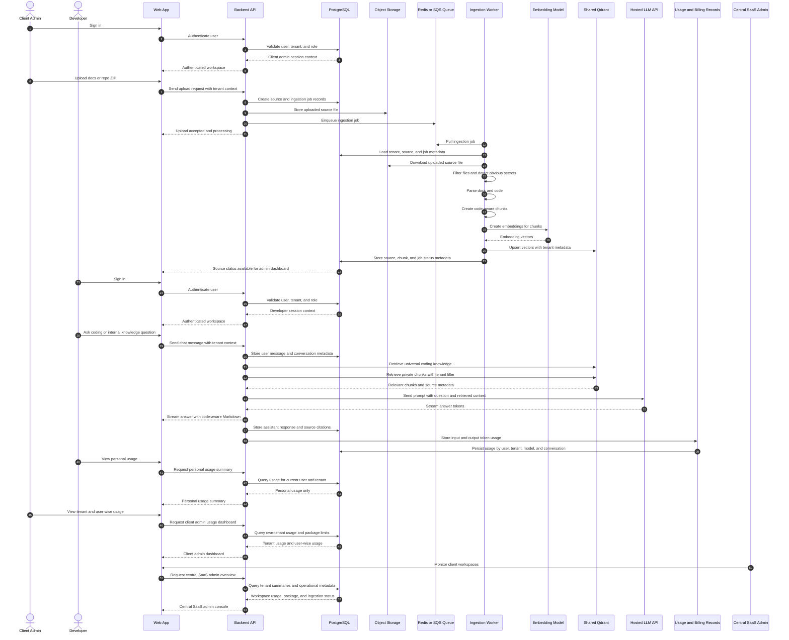

# MVP Delivery and Deployment Guideline

This document converts the business plan, MVP feature scope, and user journeys into a step-by-step delivery plan for the Custom Knowledge-Based Code Helper MVP.

The goal is to help the product, engineering, AI/RAG, DevOps, QA, and founder/GTM team work together toward a demo-ready SaaS MVP in an estimated **10-12 weeks**.

## 1. MVP Delivery Objective

Build a secure client-wise SaaS coding assistant where software firms can:

- Sign in to a tenant-specific workspace.
- Use chat for Python, PHP, .NET, backend, architecture, debugging, testing, and DevOps questions.
- Upload private documents and repository files.
- Retrieve answers from shared universal coding knowledge plus tenant-specific private knowledge.
- See source citations.
- Track token usage by tenant and individual user.
- Allow client admins to manage sources, package limits, and usage.
- Allow central SaaS admins to monitor client workspaces separately.
- Store billing-ready usage data for future Stripe integration.

The MVP is **not** an autonomous file-modifying agent. It can suggest code, explain changes, and generate snippets or tests, but developers apply changes manually. MCP-ready architecture can be considered, but actual agentic file modification, IDE automation, and PR automation belong to later phases.

## 2. MVP Feature Scope Baseline

The delivery plan must stay aligned with this MVP feature list.

| Feature | Delivery Meaning |
| --- | --- |
| User signup/login | Users can securely access the SaaS application. |
| Workspace/tenant | Each client has a separate workspace and tenant boundary. |
| Chat interface | Developers can ask questions and receive streaming AI answers. |
| Code-aware Markdown | Answers render code blocks clearly. |
| MVP language coverage | Python, PHP, and .NET are covered through prompts, parsing, RAG examples, and evaluation questions. |
| RAG ingestion | Client admins can upload docs and repository files. |
| Qdrant search | Retrieval uses universal coding knowledge plus tenant-specific private chunks. |
| Source citation | Answers show source files or document references. |
| Token tracking | Input/output tokens are tracked by user, tenant, model, and conversation. |
| Admin panel | Client admins view sources, package limits, tenant usage, and user-wise usage. |
| User usage view | Developers see only personal usage. |
| Central SaaS admin console | Provider admins monitor client workspaces, package usage, and billing operations. |
| Basic billing-ready data | Usage records are stored for manual billing and future Stripe integration. |
| Guardrails | Cross-tenant leakage is prevented by backend filters and role permissions. |
| Logs/monitoring | Basic observability exists for support, demos, and incident review. |

## 3. Team Structure and Ownership

## 3A. MVP System Work Structure

### Architecture Style Recommendation

For the MVP, use a **modular monolith backend plus one separate worker service**, not a full microservice architecture.

Reason:

- The MVP team is small.
- The feature set needs strong coordination across auth, tenant isolation, chat, RAG, usage, and admin reporting.
- Microservices would add deployment, networking, observability, and data-consistency overhead too early.
- The product can still be structured internally as clean modules so individual modules can be extracted later if scale requires it.

Recommended MVP structure:

| Layer | MVP Recommendation | Why |
| --- | --- | --- |
| Frontend | One web application | Supports developer portal, client admin, and central SaaS admin through role-based routes. |
| Backend API | One modular monolith API | Faster delivery, simpler tenant enforcement, simpler deployment. |
| Worker | One background worker service | Handles ingestion, chunking, embedding, Qdrant writes, and async jobs separately from API traffic. |
| Data layer | Managed PostgreSQL, shared Qdrant, object storage, Redis/queue | Keeps storage responsibilities clear and scalable. |
| LLM layer | Hosted LLM API | No GPU or self-hosted model infrastructure needed for MVP. |

### Required Applications and Services

The MVP should be built with **two deployable application services** plus managed infrastructure.

| Unit | Type | Responsibility | Owner |
| --- | --- | --- | --- |
| `web-app` | Frontend application | Developer chat, personal usage, client admin dashboard, central SaaS admin console | Frontend Engineer |
| `api-service` | Backend API application | Auth, tenants, roles, conversations, LLM calls, usage tracking, admin APIs, source APIs | Backend Engineer |
| `worker-service` | Background worker | File parsing, chunking, embeddings, Qdrant upsert, deletion jobs, ingestion status | AI/RAG Engineer + Backend Engineer |
| PostgreSQL | Managed database | Users, tenants, roles, conversations, messages, sources, usage, package limits, billing-ready records | Backend Engineer + DevOps |
| Qdrant | Managed/shared vector DB | Universal coding knowledge and tenant-specific private vectors | AI/RAG Engineer |
| Object storage | Managed storage | Uploaded docs, repository ZIPs, source snapshots | DevOps Engineer |
| Redis/queue | Managed queue/cache | Ingestion job queue and lightweight background coordination | Backend Engineer + DevOps |
| Hosted LLM API | External model API | Answer generation from prompts and retrieved context | AI/RAG Engineer + Backend Engineer |
| Monitoring/logging | Managed/cloud-native | API logs, worker logs, ingestion failures, LLM errors, usage anomalies | DevOps Engineer |

### Frontend Application Modules

Use **one frontend application** with role-aware navigation.

Recommended stack:

- Next.js with React and TypeScript.
- Tailwind CSS or a component library such as shadcn/ui.
- Server-side or client-side auth integration depending on chosen auth provider.
- Markdown/code rendering using a maintained Markdown renderer with syntax highlighting.

Frontend modules:

| Module | Screens |
| --- | --- |
| Auth | Login, signup, logout, session expiry |
| Developer chat | Chat list, chat window, streaming response, cited answer, code blocks |
| Personal usage | User token usage, conversation usage summary |
| Client admin | Source upload, source list, ingestion status, source deletion |
| Client usage admin | Tenant usage, package limit, user-wise token usage |
| Central SaaS admin | Tenant list, package usage, ingestion health, billing-ready usage summary |
| Shared UI | Role-aware layout, navigation, loading states, error states |

### Backend API Modules

Use **one backend API** organized as internal modules.

Recommended stack:

- **FastAPI with Python** if the team wants fastest alignment with AI/RAG work.
- NestJS with TypeScript is also viable, but FastAPI is the recommended MVP choice because ingestion, embeddings, RAG evaluation, and AI tooling are usually easier in Python.
- SQLAlchemy or SQLModel for ORM.
- Alembic for migrations.
- Pydantic for validation.
- OpenAPI generated from FastAPI for frontend integration.

Backend modules:

| Module | Responsibility |
| --- | --- |
| Auth module | Login integration, session/JWT validation, current user context |
| Tenant module | Workspaces, tenant membership, role resolution |
| RBAC module | Developer, client admin, central SaaS admin permissions |
| Conversation module | Chat sessions, messages, streaming response coordination |
| LLM module | Hosted LLM API wrapper, prompt execution, token accounting |
| Retrieval module | Universal plus tenant-specific Qdrant retrieval with filters |
| Source module | Source records, upload metadata, delete requests |
| Usage module | User-wise and tenant-wise token records |
| Admin module | Client admin APIs and central SaaS admin APIs |
| Billing-ready module | Package limits, usage summaries, export-ready records |
| Observability module | Structured logs, request IDs, error records |

### Data Layer Modules

PostgreSQL should be the system of record. Qdrant should store vectors and retrieval metadata, not billing or user records.

Recommended PostgreSQL tables:

| Table | Purpose |
| --- | --- |
| `users` | User identity and profile fields |
| `tenants` | Client workspaces |
| `tenant_memberships` | User-to-tenant role mapping |
| `roles` or role enum | Developer, client admin, central SaaS admin |
| `conversations` | Chat sessions |
| `messages` | User and assistant messages |
| `sources` | Uploaded documents/repository files |
| `ingestion_jobs` | Async ingestion status and errors |
| `usage_records` | Input/output tokens by user, tenant, model, conversation |
| `package_limits` | Plan name, token limit, storage limit, usage limit |
| `billing_exports` | Manual billing snapshots or future Stripe export records |
| `audit_events` | Admin actions, source deletion, package changes |

Recommended Qdrant collection strategy:

| Collection | Purpose |
| --- | --- |
| `universal_coding_knowledge` | Shared coding manuals, public best practices, framework notes |
| `tenant_knowledge` | Private client chunks with strict `tenant_id`, `workspace_id`, `source_id`, language, and file metadata |

Larger clients can later move to a dedicated collection or dedicated Qdrant cluster.

### Ingestion and RAG/MLOps Modules

For MVP, treat RAG/MLOps as a practical ingestion and evaluation pipeline, not a full model-training platform.

RAG pipeline:

1. Client admin uploads file or repository ZIP.
2. API stores file in object storage.
3. API creates an `ingestion_jobs` record.
4. API queues a background ingestion job.
5. Worker downloads the file from object storage.
6. Worker filters unsupported files and obvious secrets.
7. Worker parses code/docs and detects language where possible.
8. Worker chunks content using code-aware chunking.
9. Worker creates embeddings through embedding API or hosted embedding model.
10. Worker upserts vectors into Qdrant with tenant/source/file/language metadata.
11. Worker stores source and chunk metadata in PostgreSQL.
12. Worker marks ingestion job as completed or failed.
13. Chat retrieval fetches universal coding knowledge plus tenant-specific private chunks.
14. LLM receives retrieved context and generates cited answer.

### End-to-End MVP RAG and Chat Sequence

Diagram source file: `../diagrams/08-end-to-end-mvp-rag-sequence.mmd`

This sequence shows the full MVP path from client admin onboarding and source upload to developer chat, retrieval, cited answer generation, usage tracking, and admin monitoring.



RAG/MLOps deliverables:

| Deliverable | MVP Requirement |
| --- | --- |
| Chunking strategy | Separate behavior for code, Markdown/text, and large files |
| Metadata schema | `tenant_id`, `workspace_id`, `source_id`, file path, language, chunk ID |
| Embedding process | Batch-safe and retryable |
| Evaluation set | 50-100 questions across Python, PHP, .NET, private docs, and DevOps |
| Prompt versioning | Track prompt templates in code or config |
| Retrieval evaluation | Check relevance, citation accuracy, and cross-tenant isolation |
| Knowledge refresh | Re-upload or delete/re-ingest in MVP; automated sync later |

### MVP Module Count Summary

| Category | Count | Notes |
| --- | ---: | --- |
| Frontend apps | 1 | One role-aware Next.js app |
| Backend apps | 1 | One modular FastAPI API |
| Worker apps | 1 | One ingestion/RAG worker |
| Managed databases | 2 | PostgreSQL and Qdrant |
| Managed storage/queue | 2 | Object storage and Redis/queue |
| Hosted model APIs | 1-2 | Chat LLM plus embedding model/API |

This is enough to support the full MVP without creating unnecessary microservice overhead.

### MVP Team

| Role | Primary Ownership | Secondary Responsibility |
| --- | --- | --- |
| Founder/Product Owner | Vision, scope, customer discovery, investor demo, pricing assumptions | Acceptance review, design partner coordination |
| Tech Lead | Architecture, delivery sequencing, code review, model strategy, technical decisions | Cross-team coordination, release readiness |
| Backend Engineer | Auth, tenant model, APIs, conversations, usage tracking, admin APIs | Security enforcement, data model, billing-ready records |
| Frontend Engineer | Chat UI, developer portal, client admin dashboard, central admin views | Responsive UX, error states, demo polish |
| AI/RAG Engineer | Ingestion, chunking, embeddings, Qdrant schema, retrieval, prompt templates, evaluation | Source citation quality, hallucination reduction |
| DevOps Engineer | Docker, environments, CI/CD, cloud deployment, monitoring, backups | Release automation, rollback, secrets handling |
| QA/Product Analyst | Test cases, user journey validation, regression checklist, demo validation | Acceptance criteria, bug triage, documentation checks |

### Decision Ownership

| Decision Area | Owner | Required Review |
| --- | --- | --- |
| MVP scope changes | Founder/Product Owner | Tech Lead |
| Architecture | Tech Lead | Backend, AI/RAG, DevOps |
| Tenant isolation | Tech Lead | Backend, DevOps, QA |
| RAG retrieval quality | AI/RAG Engineer | Product, QA |
| Deployment readiness | DevOps Engineer | Tech Lead, QA |
| Investor demo readiness | Founder/Product Owner | Tech Lead, QA |

## 4. Delivery Governance

### Weekly Operating Rhythm

| Meeting | Cadence | Owner | Output |
| --- | --- | --- | --- |
| Sprint planning | Every 2 weeks | Tech Lead + Product Owner | Sprint backlog and acceptance criteria |
| Daily standup | Daily | Tech Lead | Blockers, progress, next steps |
| Architecture sync | Weekly | Tech Lead | Technical decisions and dependency resolution |
| RAG quality review | Weekly from Week 4 | AI/RAG Engineer | Retrieval and answer-quality findings |
| QA triage | Twice weekly from Week 6 | QA/Product Analyst | Bug priority and release risks |
| Demo review | Weekly from Week 8 | Founder/Product Owner | Demo script and readiness gaps |
| Release readiness review | Week 10 onward | DevOps Engineer | Staging/prod checklist and go/no-go |

### Definition of Ready

A task should enter a sprint only when:

- The user role is clear.
- The tenant boundary requirement is known.
- Acceptance criteria are written.
- Required API/data dependencies are identified.
- Security or billing impact is understood.
- Test expectation is defined.

### Definition of Done

A task is done only when:

- Code is merged or document/artifact is approved.
- Basic tests or validation are complete.
- Tenant isolation is not weakened.
- Logs or error states exist where needed.
- The feature works in at least local or staging environment.
- User-facing behavior is reflected in demo notes or product documentation if relevant.

## 5. Environment Strategy

| Environment | Purpose | Owner | Timing |
| --- | --- | --- | --- |
| Local development | Individual developer work and integration testing | Each engineer | Week 1 |
| Shared development | Early API/UI integration | DevOps + Tech Lead | Week 2-3 |
| Staging | End-to-end QA, demo rehearsal, release validation | DevOps + QA | Week 6-8 |
| Production MVP | Investor/design partner demo and controlled beta | DevOps + Tech Lead | Week 10-12 |

### MVP Deployment Architecture

Recommended MVP deployment:

- Frontend: Vercel, Cloudflare Pages, or AWS Amplify.
- Backend: Dockerized API container on AWS ECS Fargate for an AWS-first MVP.
- Worker: Dockerized worker service on AWS ECS Fargate.
- PostgreSQL: Amazon RDS PostgreSQL.
- Redis/queue: Amazon ElastiCache Redis or SQS for queue-only MVP needs.
- Object storage: Amazon S3.
- Vector DB: Qdrant Cloud or self-managed Qdrant on a small VM/container if needed.
- LLM: hosted LLM API first, such as GPT-5.4 mini or equivalent.
- Monitoring: CloudWatch logs/metrics plus basic alerts.

### AWS-First MVP Recommendation

Recommended AWS MVP setup:

| Component | AWS Service | MVP Recommendation |
| --- | --- | --- |
| Frontend | AWS Amplify or CloudFront + S3 | Use Amplify for speed, or Vercel/Cloudflare if the team prefers frontend-first deployment. |
| Backend API | ECS Fargate | Run one Dockerized FastAPI service. |
| Worker | ECS Fargate scheduled/long-running task | Run ingestion jobs without managing servers. |
| Database | RDS PostgreSQL | Managed backups, stable relational system of record. |
| Queue | SQS or ElastiCache Redis | Use SQS if only async jobs are needed; Redis if the app also needs cache/streaming coordination. |
| Object storage | S3 | Store uploads, repository ZIPs, and source snapshots. |
| Vector DB | Qdrant Cloud | Prefer managed Qdrant for MVP simplicity. |
| Secrets | AWS Secrets Manager or SSM Parameter Store | Store LLM keys, database credentials, Qdrant keys. |
| Logs/metrics | CloudWatch | Centralized API and worker logs. |
| DNS/TLS | Route 53 + ACM | Production domain and TLS certificate if deployed fully on AWS. |

### Do We Need EKS for MVP?

No. **Do not use EKS/Kubernetes for the MVP unless the team already has strong Kubernetes operations experience and a clear enterprise requirement.**

Use ECS Fargate for MVP because:

- Lower operational overhead.
- Easier deployment and rollback.
- Enough for one API service and one worker service.
- No Kubernetes cluster management.
- Cheaper and faster for a 10-12 week MVP.

Use EKS later when:

- There are many services and worker types.
- The product needs advanced autoscaling policies.
- The team introduces self-hosted model serving.
- Enterprise/private deployment requires Kubernetes.
- Platform/SRE capacity exists.

### Do We Need GPU for MVP?

No. **GPU is not required for MVP** if the product uses a hosted LLM API and hosted or API-based embeddings.

GPU is only needed later for:

- Self-hosted LLM inference.
- High-volume self-hosted embedding generation.
- Fine-tuning or LoRA experiments.
- Enterprise private model deployment.

MVP should avoid GPU to keep cost, DevOps complexity, and delivery risk low.

### Recommended Repository and Application Structure

If the team starts a code repository, use a monorepo with clear application boundaries:

```text
.
├── apps/
│   ├── web/                 # Next.js frontend
│   ├── api/                 # FastAPI backend API
│   └── worker/              # Ingestion/RAG worker
├── packages/
│   ├── shared-types/        # Optional generated API/client types
│   └── prompts/             # Prompt templates and versions
├── infra/
│   ├── docker/              # Dockerfiles and compose files
│   ├── github-actions/      # CI/CD workflow references
│   └── terraform/           # Optional AWS IaC later
├── docs/
│   ├── mvp-user-journeys.md
│   └── mvp-delivery-and-deployment-guideline.md
└── README.md
```

For the first MVP, the infrastructure can be created manually or with lightweight Terraform. Full infrastructure-as-code is recommended before paid pilots, but it should not block the first investor demo if the team is small.

## 6. Week-by-Week MVP Delivery Plan

### Week 0-1: Product Discovery and Technical Foundation

Goal: lock scope, define roles, and prepare the engineering foundation.

| Team | Step-by-Step Work | Output |
| --- | --- | --- |
| Founder/Product Owner | Confirm target customer, package assumptions, MVP user roles, demo goal, and out-of-scope items. | Approved MVP scope and demo target |
| Tech Lead | Finalize high-level architecture, data boundaries, model strategy, and delivery sequence. | Architecture decision notes |
| Backend Engineer | Draft data model for users, tenants, roles, conversations, usage, sources, and billing records. | Initial schema proposal |
| Frontend Engineer | Wireframe developer chat, client admin, central SaaS admin, and usage screens. | Clickable or static wireframes |
| AI/RAG Engineer | Define ingestion formats, chunking strategy, metadata schema, and evaluation question categories. | RAG design note |
| DevOps Engineer | Create repo structure, Docker baseline, environment variable policy, CI skeleton, and deployment target plan. | DevOps foundation checklist |
| QA/Product Analyst | Convert MVP user stories and journeys into acceptance criteria and test scenarios. | MVP test plan draft |

Exit criteria:

- MVP feature list is frozen for the first build cycle.
- Team agrees that agentic file modification is out of MVP.
- Security principle is clear: no cross-tenant retrieval.

### Week 2-3: Auth, Tenant Model, Base UI, and Core APIs

Goal: establish the SaaS shell and tenant-aware application base.

| Team | Step-by-Step Work | Output |
| --- | --- | --- |
| Backend Engineer | Implement user signup/login integration, tenant/workspace model, role model, session/JWT handling, and base API structure. | Auth and tenant APIs |
| Frontend Engineer | Build login, workspace selector if needed, base layout, navigation, empty chat state, and role-aware menus. | Usable app shell |
| Tech Lead | Review auth and tenant logic, enforce role naming, and confirm database constraints. | Approved tenant model |
| DevOps Engineer | Set up CI checks, container build, development environment, and initial staging infrastructure plan. | CI and local deployment flow |
| QA/Product Analyst | Test login, role access, and tenant assignment cases. | Auth/tenant test report |
| Founder/Product Owner | Review UX flow and confirm that it matches investor/demo narrative. | UX feedback |

Exit criteria:

- Developer, client admin, and central SaaS admin can be represented in the system.
- Tenant ID is available to backend services for all future data access.
- Basic UI is ready for chat and admin modules.

### Week 4-5: Chat, Hosted LLM Integration, Usage Tracking, and Language Support

Goal: deliver the first working chat experience.

| Team | Step-by-Step Work | Output |
| --- | --- | --- |
| Backend Engineer | Build conversation API, message storage, streaming response endpoint, model call wrapper, and token logging. | Chat backend |
| Frontend Engineer | Build chat composer, streaming answer display, code-aware Markdown rendering, conversation history, and error states. | Developer chat UI |
| AI/RAG Engineer | Create prompt templates for Python, PHP, .NET, source-grounded answers, and refusal/uncertainty behavior. | MVP prompt pack |
| Tech Lead | Review model API abstraction so future model routing or self-hosting remains possible. | Model integration approval |
| DevOps Engineer | Add secrets handling for LLM API keys and basic runtime logging. | Secure config setup |
| QA/Product Analyst | Test chat flow, streaming behavior, code rendering, token logging, and basic language examples. | Chat validation report |

Exit criteria:

- A developer can ask a question and receive a streamed answer.
- Token usage is recorded by user, tenant, model, and conversation.
- Python, PHP, and .NET basic examples render correctly.

### Week 6-7: RAG Ingestion, Qdrant Retrieval, and Source Citations

Goal: connect uploaded knowledge to source-backed answers.

| Team | Step-by-Step Work | Output |
| --- | --- | --- |
| Backend Engineer | Build file upload APIs, source metadata APIs, ingestion job records, and source deletion endpoint. | Source management APIs |
| AI/RAG Engineer | Implement parsing, file filtering, code-aware chunking, embedding generation, Qdrant upsert, tenant metadata, and top-k retrieval. | Working RAG pipeline |
| Frontend Engineer | Build client admin source upload screen, source list, ingestion status, and delete action. | Source management UI |
| DevOps Engineer | Configure object storage, queue/worker runtime, Qdrant environment, and ingestion logs. | Ingestion infrastructure |
| Tech Lead | Review retrieval filters to ensure universal knowledge and tenant-specific knowledge are separated correctly. | RAG security review |
| QA/Product Analyst | Test upload, ingestion, retrieval, citation display, deletion, and no-cross-tenant retrieval. | RAG QA report |

Exit criteria:

- Client admin can upload docs/repo files.
- Assistant retrieves tenant-specific chunks plus universal coding knowledge.
- Answers include citations.
- Deleted sources no longer appear in retrieval.
- Cross-tenant retrieval tests pass.

### Week 8: Admin Panels, Usage Views, and Billing-Ready Records

Goal: make the SaaS workflow visible to client admins and provider admins.

| Team | Step-by-Step Work | Output |
| --- | --- | --- |
| Backend Engineer | Build tenant usage, user-wise usage, package limit fields, billing-ready usage queries, and central tenant monitoring APIs. | Admin/usage APIs |
| Frontend Engineer | Build client admin dashboard, user usage table, source summary, package usage card, personal usage view, and central SaaS admin overview. | Admin dashboards |
| DevOps Engineer | Add log aggregation and basic metrics for API, worker, ingestion status, and LLM errors. | Basic observability |
| QA/Product Analyst | Validate role access: developer personal usage, client admin own-tenant usage, central admin all-tenant summary. | Role validation report |
| Founder/Product Owner | Review admin screens for investor demo clarity and business narrative. | Demo feedback |

Exit criteria:

- Client admin can see tenant and user-wise usage.
- Developer can see only personal usage.
- Central SaaS admin can monitor clients separately.
- Billing-ready records can support manual invoice preparation.

### Week 9: Security, Guardrails, Evaluation, and Hardening

Goal: reduce demo risk and protect tenant boundaries.

| Team | Step-by-Step Work | Output |
| --- | --- | --- |
| Tech Lead | Run architecture review covering tenant isolation, data access, API permissions, secrets, and logging. | Security review notes |
| Backend Engineer | Add missing permission checks, rate/usage guardrails, validation, and error handling. | Hardened backend |
| AI/RAG Engineer | Build 50-100 question evaluation set across Python, PHP, .NET, private docs, and DevOps. Test answer quality and citations. | RAG evaluation report |
| Frontend Engineer | Improve empty states, loading states, failed upload handling, and admin error messages. | Polished MVP UI |
| DevOps Engineer | Configure staging backups, alert thresholds, environment separation, and release rollback notes. | Staging readiness |
| QA/Product Analyst | Run regression tests across user journeys and document critical bugs. | Regression report |

Exit criteria:

- Tenant isolation tests pass.
- RAG answer quality is acceptable for demo scenarios.
- Critical bugs are fixed or explicitly deferred.
- Staging environment is stable for demo rehearsal.

### Week 10: End-to-End QA, Demo Script, and Staging Release

Goal: make the product demo-ready.

| Team | Step-by-Step Work | Output |
| --- | --- | --- |
| Founder/Product Owner | Prepare 5-minute and 15-minute demo scripts for investor and design partner use. | Demo scripts |
| QA/Product Analyst | Execute end-to-end journeys for developer, client admin, central SaaS admin, support, and billing operator. | E2E test evidence |
| Frontend Engineer | Fix UI defects, responsive layout issues, and demo polish gaps. | Demo-ready UI |
| Backend Engineer | Fix API bugs, usage reporting issues, and edge cases from QA. | Stable backend |
| AI/RAG Engineer | Tune prompts, retrieval limits, citation formatting, and fallback behavior. | Improved answer quality |
| DevOps Engineer | Deploy staging release, document deployment steps, and verify logs/metrics. | Staging release candidate |
| Tech Lead | Run go/no-go review for production MVP deployment. | Release decision |

Exit criteria:

- Staging release passes all P0 journey tests.
- Demo data and demo workspace are prepared.
- Known limitations are documented.

### Week 11: Production MVP Deployment and Controlled Demo Readiness

Goal: deploy the MVP for investor/demo use and selected design partner testing.

| Team | Step-by-Step Work | Output |
| --- | --- | --- |
| DevOps Engineer | Deploy production MVP, configure DNS/domain if needed, verify environment variables, backups, logs, and rollback path. | Production MVP |
| Backend Engineer | Verify production database migrations, tenant seed data, central admin account, and usage tracking. | Production backend validation |
| Frontend Engineer | Verify production frontend routes, auth, chat, admin dashboards, and responsive behavior. | Production frontend validation |
| AI/RAG Engineer | Upload demo knowledge base, verify embeddings, citations, and retrieval quality in production. | Production RAG validation |
| QA/Product Analyst | Run smoke tests across all critical journeys. | Production smoke test report |
| Founder/Product Owner | Run investor demo rehearsal and design partner onboarding rehearsal. | Demo readiness signoff |

Exit criteria:

- Production MVP is usable for controlled demos.
- Critical monitoring exists.
- Rollback path is documented.
- Demo script works against production or staging reliably.

### Week 12: Buffer, Pilot Preparation, and Investor Package

Goal: stabilize, document, and prepare for private beta.

| Team | Step-by-Step Work | Output |
| --- | --- | --- |
| Founder/Product Owner | Finalize investor narrative, pricing assumptions, pilot offer, and design partner list. | Investor/demo package |
| Tech Lead | Document architecture, technical limitations, and Phase 1 recommendations. | Technical handoff note |
| Backend Engineer | Close remaining P0/P1 bugs and document API/data model decisions. | Backend handoff |
| Frontend Engineer | Close UI polish issues and prepare demo screenshots if needed. | UI handoff |
| AI/RAG Engineer | Document evaluation results, prompt versions, known retrieval limits, and next improvements. | RAG handoff |
| DevOps Engineer | Finalize runbook, backup notes, monitoring guide, and deployment checklist. | Operations runbook |
| QA/Product Analyst | Create final MVP test report and known issue list. | QA signoff package |

Exit criteria:

- MVP is ready for investor demo and 3-5 controlled test teams.
- Known risks and limitations are documented.
- Phase 1 backlog is ready to refine.

## 7. Cross-Team Dependency Map

| Dependency | Owner | Needed By | Timing |
| --- | --- | --- | --- |
| Tenant model | Backend Engineer | Frontend, AI/RAG, QA, central admin | Week 2 |
| Role permissions | Backend Engineer | Frontend, QA, security review | Week 3 |
| Chat API | Backend Engineer | Frontend, AI/RAG, QA | Week 4 |
| Model wrapper | Backend Engineer + AI/RAG Engineer | Chat, token tracking, prompt testing | Week 4 |
| Upload/source schema | Backend Engineer | Frontend, AI/RAG, DevOps | Week 6 |
| Qdrant metadata schema | AI/RAG Engineer | Backend, QA, security review | Week 6 |
| Object storage and worker | DevOps Engineer | AI/RAG ingestion, backend APIs | Week 6 |
| Usage schema | Backend Engineer | Admin dashboards, billing operator journey | Week 8 |
| Central admin APIs | Backend Engineer | Frontend, support/billing journeys | Week 8 |
| Staging deployment | DevOps Engineer | QA, demo rehearsal | Week 8-10 |
| Evaluation dataset | AI/RAG Engineer + QA | Demo readiness, hallucination risk control | Week 9 |

## 8. Workstream Detail

### Product and UX Workstream

Step-by-step process:

1. Confirm MVP personas: developer, client admin, central SaaS admin, support, billing operator, founder/demo user, investor reviewer.
2. Confirm primary journeys from `docs/mvp-user-journeys.md`.
3. Translate journeys into screens: login, chat, source management, admin usage, central admin overview, personal usage.
4. Define package limit display and usage terminology.
5. Prepare demo scripts for investor and design partner versions.
6. Review every sprint output against user journey success outcomes.

Key deliverables:

- MVP journey map.
- Screen wireframes.
- Demo script.
- Acceptance criteria.
- Investor demo data plan.

### Backend Workstream

Step-by-step process:

1. Design core schema: users, tenants, memberships, roles, conversations, messages, sources, ingestion jobs, usage records, package limits.
2. Implement authentication and tenant resolution.
3. Enforce backend tenant filters on every tenant-owned resource.
4. Build chat and conversation APIs.
5. Integrate hosted LLM API through an abstraction layer.
6. Record usage for every LLM request.
7. Build file/source APIs and ingestion job records.
8. Build admin APIs for client admins and central SaaS admins.
9. Build billing-ready usage queries.
10. Add validation, error handling, and audit-friendly logs.

Key deliverables:

- Tenant-safe API.
- Chat/conversation service.
- Usage tracking service.
- Admin and central admin APIs.
- Billing-ready records.

### Frontend Workstream

Step-by-step process:

1. Build base app layout and role-aware navigation.
2. Build login and workspace entry experience.
3. Build developer chat UI with streaming responses.
4. Render code-aware Markdown and citations.
5. Build user personal usage view.
6. Build client admin source upload and source list screens.
7. Build client admin tenant usage and user-wise usage dashboard.
8. Build central SaaS admin overview for separate client monitoring.
9. Add loading, empty, error, and retry states.
10. Polish UI for investor and design partner demo.

Key deliverables:

- Developer portal.
- Client admin dashboard.
- Central SaaS admin console.
- Demo-ready responsive UI.

### AI/RAG Workstream

Step-by-step process:

1. Define supported file types for MVP.
2. Build file parsing and code-aware chunking for Python, PHP, .NET, Markdown, text, and common docs.
3. Add metadata tagging: tenant, workspace, source, file path, language, user, chunk ID.
4. Generate embeddings and store vectors in shared Qdrant with tenant filters.
5. Create universal coding knowledge collection.
6. Implement retrieval over universal knowledge plus tenant-specific private chunks.
7. Build prompt template for source-grounded answers.
8. Add citation formatting.
9. Create evaluation set of 50-100 questions.
10. Tune retrieval count, prompt instructions, and fallback behavior.

Key deliverables:

- Ingestion pipeline.
- Qdrant schema and retrieval logic.
- Prompt templates.
- Evaluation report.
- Citation quality review.

### DevOps Workstream

Step-by-step process:

1. Define local development setup.
2. Dockerize backend and worker services.
3. Configure frontend deployment.
4. Configure managed PostgreSQL, Redis/queue, object storage, and Qdrant.
5. Set up GitHub Actions CI/CD checks and deployment path.
6. Create development, staging, and production environments.
7. Set secrets policy and environment variable handling.
8. Add logging, metrics, and alert basics.
9. Configure backups for PostgreSQL and object storage.
10. Document rollback and incident response basics.

Key deliverables:

- CI/CD pipeline.
- Staging environment.
- Production MVP deployment.
- Monitoring and backup baseline.
- Deployment runbook.

Recommended GitHub Actions pipelines:

| Pipeline | Trigger | Steps |
| --- | --- | --- |
| Frontend CI | Pull request to main | Install, lint, typecheck, unit tests, build |
| Backend CI | Pull request to main | Install, lint, typecheck if applicable, unit tests, migration check |
| Worker CI | Pull request to main | Install, lint, unit tests, ingestion parser tests |
| Security check | Pull request to main | Secret scan, dependency audit, basic static checks |
| Staging deploy | Merge to main or manual dispatch | Build images, push to registry, migrate staging DB, deploy API/worker/frontend, run smoke tests |
| Production deploy | Manual approval | Build or promote image, backup DB, migrate production DB, deploy services, run smoke tests |

Minimum AWS CI/CD path:

1. GitHub Actions builds Docker images for `api-service` and `worker-service`.
2. Images are pushed to Amazon ECR.
3. GitHub Actions updates ECS Fargate services.
4. Database migrations run as a one-off ECS task or controlled CI step.
5. Frontend deploys to Amplify, Vercel, or Cloudflare Pages.
6. Smoke tests run against staging/production URL.
7. Failed smoke test blocks production promotion.

### QA and Product Analysis Workstream

Step-by-step process:

1. Convert MVP features into acceptance criteria.
2. Build test cases by persona and journey.
3. Test role permissions and tenant isolation.
4. Test chat, streaming, citations, and usage tracking.
5. Test upload, ingestion, deletion, and retrieval.
6. Test admin dashboards and central admin console.
7. Run cross-browser and responsive UI checks.
8. Run staging regression before production deployment.
9. Maintain known issue list and release risk summary.
10. Validate investor demo script against actual product behavior.

Key deliverables:

- Test plan.
- Regression checklist.
- Tenant isolation test report.
- Demo validation report.
- MVP QA signoff.

## 9. Deployment Runbook

### Pre-Deployment Checklist

Before deploying staging or production:

- Code merged and reviewed.
- Database migrations reviewed.
- Environment variables configured.
- LLM API key stored securely.
- Qdrant endpoint and collection names configured.
- Object storage bucket configured.
- Redis/queue configured.
- Seed admin account or admin creation process ready.
- Logging enabled.
- Backup policy confirmed.
- Smoke test checklist prepared.

### AWS Infrastructure Setup Steps

Recommended order for an AWS-first MVP:

1. Create AWS account structure and IAM access policy for the engineering team.
2. Create ECR repositories for `api-service` and `worker-service`.
3. Create RDS PostgreSQL instance with automated backups.
4. Create S3 bucket for uploaded documents and repository ZIPs.
5. Create SQS queue or ElastiCache Redis for ingestion jobs.
6. Create ECS cluster using Fargate capacity.
7. Create ECS task definition for `api-service`.
8. Create ECS task definition for `worker-service`.
9. Create Application Load Balancer for the API if using ECS.
10. Store secrets in AWS Secrets Manager or SSM Parameter Store.
11. Configure CloudWatch log groups for API and worker.
12. Connect frontend hosting to the backend API URL.
13. Configure Route 53 and ACM if using a custom production domain.
14. Configure GitHub Actions permissions for ECR/ECS deployment.
15. Run first staging deployment and smoke test.

### Staging Deployment Steps

1. Build backend container.
2. Build ingestion worker container.
3. Push containers to ECR or selected registry.
4. Deploy database migrations to staging.
5. Deploy backend API to staging ECS Fargate or selected app platform.
6. Deploy worker to staging ECS Fargate or selected worker platform.
7. Deploy frontend to Amplify, Vercel, or Cloudflare Pages.
8. Configure staging environment variables and secrets.
9. Upload sample knowledge base.
10. Run smoke tests.
11. Run role and tenant-isolation tests.
12. Run demo script against staging.

### Production MVP Deployment Steps

1. Confirm go/no-go approval from Product Owner, Tech Lead, QA, and DevOps.
2. Freeze release candidate.
3. Backup current production database if production already exists.
4. Apply production database migrations.
5. Deploy or promote backend API container.
6. Deploy or promote ingestion worker container.
7. Deploy or promote frontend.
8. Verify LLM, Qdrant, PostgreSQL, Redis/SQS, and object storage connectivity.
9. Create or verify central SaaS admin account.
10. Create demo tenant and demo users.
11. Upload demo knowledge base.
12. Run production smoke test.
13. Verify logs, metrics, and usage tracking.
14. Mark release ready for controlled demo.

### Rollback Guidelines

Rollback should be possible when:

- The frontend deploy breaks primary navigation or chat.
- Backend deploy breaks auth, tenant access, chat, or admin APIs.
- Migration causes data access failure.
- Ingestion worker corrupts source metadata or retrieval.

Minimum rollback preparation:

- Keep previous frontend build available.
- Keep previous backend container image available.
- Run reversible or backup-protected database migrations.
- Keep backup before risky migrations.
- Document manual disable switches for ingestion or external LLM calls if needed.

## 10. Security and Tenant-Isolation Checklist

| Area | Required Control |
| --- | --- |
| Tenant data access | Every tenant-owned API query must filter by tenant/workspace. |
| Qdrant retrieval | Retrieval must include tenant metadata filter for private chunks. |
| Universal knowledge | Shared universal knowledge can be retrieved by all tenants. |
| Client private knowledge | Private chunks cannot be retrieved by other tenants. |
| Client admin | Can view only own tenant sources and usage. |
| Developer | Can view only own usage and authorized tenant chat context. |
| Central SaaS admin | Can view operational metadata and usage summaries, not private retrieval by default. |
| Logs | Logs must avoid exposing secrets or unnecessary source content. |
| Uploads | Secret filtering should detect common secret patterns in uploaded files. |
| Deletion | Deleted sources must be removed from retrieval. |

## 11. MVP Testing Matrix

| Test Area | Minimum Test |
| --- | --- |
| Auth | Login, logout, invalid login, session expiry. |
| Tenant isolation | User from tenant A cannot access tenant B sources, conversations, usage, or retrieval chunks. |
| Chat | Ask question, stream answer, save conversation, render code. |
| Language support | Python, PHP, and .NET example questions. |
| RAG ingestion | Upload, parse, chunk, embed, store, retrieve. |
| Source citation | Answer includes source references. |
| Source deletion | Deleted source is no longer retrieved. |
| Usage tracking | Input/output tokens stored with user, tenant, model, conversation. |
| Client admin | Source list, usage summary, user-wise usage, package limit display. |
| Central admin | Tenant list, usage summary, ingestion status, billing-ready records. |
| Guardrails | Cross-tenant access blocked. |
| Monitoring | API error, worker error, and LLM error visible in logs. |

## 12. MVP Demo Readiness Checklist

The MVP is demo-ready when:

- A demo tenant exists.
- Demo developer, client admin, and central SaaS admin accounts exist.
- Demo knowledge base includes safe Python, PHP, .NET, architecture, and DevOps examples.
- Developer can ask questions and receive cited answers.
- Client admin can upload, view, and delete sources.
- Client admin can view tenant usage and user-wise usage.
- Developer can view only personal usage.
- Central SaaS admin can monitor client workspaces separately.
- Token usage appears in billing-ready records.
- Logs and monitoring show basic operational health.
- Demo script can be completed in 5 minutes and 15 minutes.
- Known limitations are documented.

## 13. Risks and Mitigation During Delivery

| Risk | Delivery Mitigation |
| --- | --- |
| MVP scope creep | Freeze P0 scope in Week 1 and defer Phase 1/2 items. |
| RAG quality is weak | Build evaluation questions early and tune retrieval weekly. |
| LLM cost surprise | Track token usage from first chat integration. |
| Tenant leakage | Write explicit isolation tests and review every data query. |
| Ingestion delays | Start with ZIP/file upload before live GitHub connector. |
| UI polish delays | Build simple workflows first, then polish demo paths. |
| Deployment instability | Use staging from Week 6-8 and production only after smoke tests. |
| Investor demo mismatch | Rehearse with actual product, not only slides. |

## 14. Phase 1 Handoff Backlog

These are important, but should not block MVP unless explicitly reprioritized:

- GitHub repository connector.
- Stripe subscription and usage billing.
- Team invite and improved role management.
- Advanced RAG with hybrid search and metadata filtering.
- Model routing across cheaper and stronger models.
- Feedback button and answer quality analytics.
- Secret detection improvements.
- Controlled read-only MCP integrations.
- Audit logs beyond basic operational logs.

Phase 2 candidates:

- IDE extension.
- PR review automation.
- Agentic patch generation or file modification.
- Self-hosted LLM serving.
- Fine-tuning.
- Enterprise SSO.
- Private deployment.

## 15. Final Delivery Recommendation

The team should treat the MVP as a **complete but narrow SaaS workflow**:

1. Client signs in.
2. Client admin uploads private knowledge.
3. Developer asks coding questions.
4. RAG retrieves universal plus tenant-specific context.
5. Hosted LLM generates source-backed answers.
6. Usage is tracked by user and tenant.
7. Client admin and central SaaS admin can monitor usage.
8. Provider can demo, support, and prepare billing.

This keeps the MVP realistic, investor-ready, and technically safe while leaving a clear upgrade path toward MCP integrations, model routing, self-hosting, IDE extensions, and agentic workflows in later phases.
